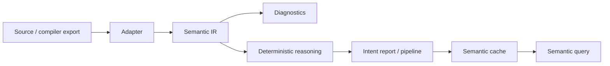

<p align="center">
  
</p>

# Vinglish Zero

**A deterministic, language-independent semantic operating system for code.**

Programming languages express syntax differently; they express intent similarly.
Vinglish Zero lowers supported languages into a shared Semantic IR and performs
symbolic reasoning without machine learning, embeddings, or external services.

## What Is Vinglish Zero?

Vinglish Zero is not a compiler and not a programming language. It is a
language-agnostic semantic analysis platform. Language adapters own frontend
integration; everything after Semantic IR is independent of the source language.

It exists to make code intent queryable, explainable, verifiable, and diagnosable
through reproducible rules rather than opaque inference.

## Key Features

- Language-agnostic Semantic IR
- Deterministic facts, evidence, hypotheses, and constraints
- Cross-language adapters for Python, Java, C, and Vinglish transport
- Compositional semantic pipelines
- Repository semantic query engine
- Per-function incremental execution hooks
- Persistent semantic cache with binary deltas
- Cross-language verification corpus
- Built-in benchmark and performance profiling commands

## Architecture



The Vinglish compiler boundary is versioned JSON only. Vinglish Zero never
imports compiler crates, parses Vinglish source itself, or accesses compiler HIR.

## CLI

```bash
vz explain examples/python/accumulator.py
vz query "filter THEN reduce"
vz verify
vz validate
vz benchmark
vz profile
vz stats
```

`vz explain` selects an adapter by extension. `vz query` searches deterministic
intent reports, pipelines, evidence, and metadata. See the
[source adapter contract](docs/architecture/source-adapters.md) and
[semantic query design](docs/design/semantic-query.md).

## Performance

The checked-in benchmark measures 92 cross-language samples. The latest report
records approximately 51 ms average frontend time, 1.1 ms average reasoning
time, and 49 us average query matching time. A warm cached repository query
avoids frontend work entirely. Results are machine-dependent; regenerate them
with `vz benchmark` and `vz profile`.

## Repository Layout

```text
crates/       Shared Rust crates: IR, reasoning, diagnostics, CLI, primitives
adapters/     Language and transport frontends
docs/         Architecture and design decisions
examples/     Representative source programs
tests/        Transport fixtures and integration coverage
verification/ Generated verification and benchmark reports
```

## Design Documents

- [Architecture overview](docs/architecture/overview.md)
- [Semantic IR](docs/design/semantic-ir.md)
- [Reasoning pipeline](docs/design/reasoning-pipeline.md)
- [Semantic composition](docs/design/semantic-composition.md)
- [Semantic query](docs/design/semantic-query.md)
- [Incremental execution](docs/design/incremental-execution.md)
- [Vinglish transport contract](docs/architecture/vinglish-transport.md)
- [Cross-language verification](docs/cross-language-verification.md)

## Building

Prerequisites: stable Rust, plus Python 3, a JDK, and Clang for the corresponding
source adapters.

```bash
cargo build --workspace --offline
cargo test --workspace --offline
cargo run -p vz-cli --offline -- verify
cargo run -p vz-cli --offline -- validate
cargo run -p vz-cli --offline -- benchmark
```

For Vinglish source, install `vng` or set `VZ_VINGLISH_COMPILER` to its path.
The explicit compiler-owned JSON workflow remains supported.

## Roadmap

**Completed**

- Deterministic Semantic IR reasoning and diagnostics
- Cross-language verification and semantic querying
- Composition, incremental cache, profiling, and benchmarks

**In Progress**

- Streaming frontend integration through the existing per-function API
- Broader official frontend coverage

**Future**

- Richer data-flow-aware semantic constructs
- Additional verified adapters and larger public corpora

## Contributing

Read [CONTRIBUTING.md](CONTRIBUTING.md) before opening an issue or pull request.
The project preserves deterministic behavior, stable transport boundaries, and
language independence as non-negotiable constraints.

## License

Licensed under the [MIT License](LICENSE).
