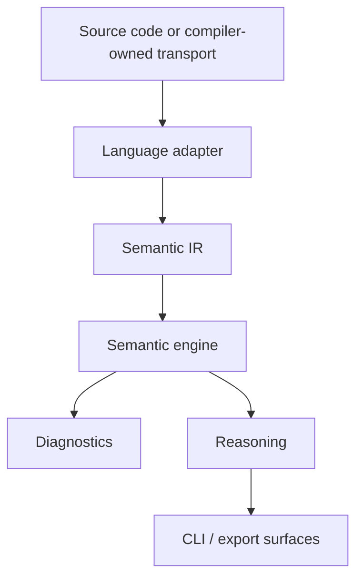

# Architecture Overview

Vinglish Zero is organized around one rule: all language-specific knowledge is
confined to adapters. Everything downstream from Semantic IR is language
agnostic.

## Boundary Rules

- Adapters translate source through their frontend, or consume an explicit
  compiler-owned transport contract, into shared semantic concepts.
- Every adapter result is validated for graph-local identifiers and dangling
  semantic references before any engine consumes it.
- Semantic IR carries meaning, relationships, and provenance, not compiler
  implementation details.
- The engine consumes only Semantic IR.
- Diagnostics describe semantic findings, not parser failures or lowering
  internals.
- Reasoning composes engine capabilities and stays IR-centric.

## Repository Rule

This repository may live inside the parent Vinglish checkout, but it is not part
of the parent workspace and must remain an independent git repository.
