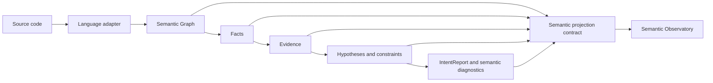
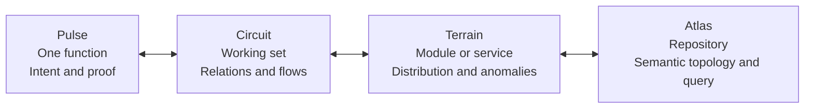

# Rendering Understanding

## A Research Design for Deterministic Program Comprehension

**Status:** Research proposal. This document describes a future rendering layer;
it does not claim that Vinglish Zero currently has a graphical interface or any
of the derived artifacts proposed below.

## Thesis

Most code-understanding tools make an engineer translate an internal model into
language. A compiler prints a diagnostic. A static analyzer lists a finding. An
IDE exposes syntax navigation. An LLM writes a plausible explanation. Each is
useful, but each leaves the engineer to reconstruct the program's meaningful
structure mentally.

**Rendering Understanding** reverses that arrangement. It treats deterministic
semantic reasoning as a visual state that an engineer can inspect, manipulate,
and replay. The primary output is not a paragraph, chat answer, or raw graph.
It is a **semantic instrument**: a stable, interactive projection of intent,
evidence, constraints, alternatives, and source provenance.

The intended reaction is not "the tool explained this code." It is "I can see
what the program is asserting, what evidence establishes it, and exactly where
that assertion can fail."

The concrete product surface proposed here is called the **Semantic
Observatory**. Its core visual object is an **Understanding Field**.



The visual layer is downstream of the existing deterministic pipeline. It does
not infer intent, inspect source text independently, call an external model, or
introduce a second semantics. It renders the same semantic conclusion that is
available in structured form today.

## The Design Problem

The right question is not "How should we draw a Semantic Graph?" A full graph
is an implementation representation, not an engineer's question. The right
question is:

> What perceptual structure lets an engineer form, test, and revise a mental
> model of code with the least translation between the engine's proof and the
> engineer's task?

The answer cannot be one fixed visualization. A five-line function and a
five-million-line repository are different cognitive objects. Rendering
Understanding therefore uses **semantic scale changes**, not continuous zoom on
a giant graph:



The selection, semantic identity, and exact evidence stay constant across
scales. The representation deliberately changes. At Atlas scale, no interface
should attempt to draw five million semantic nodes.

## Design Principles

1. **Render claims, not syntax.** Syntax remains an exact calibration surface
   reachable on demand. It is not the default object of attention.
2. **Every pixel with semantic meaning must be reversible.** A visible
   confidence contour, highlighted evidence, or rejected hypothesis must point
   to a stable structured identifier and a deterministic derivation.
3. **Show alternatives as first-class state.** The winning intent alone hides
   uncertainty and prevents engineers from questioning a conclusion.
4. **Use perception for pre-attentive distinctions; reserve language for
   precision.** Shape, topology, stroke, and motion establish state before a
   user reads a label. Exact names, scores, and rule identifiers appear on
   focus.
5. **Use motion only for a semantic delta.** Animation must reveal a fact
   becoming evidence, an evidence item satisfying a rule, or a report changing
   under a counterfactual. Decorative motion is prohibited.
6. **Keep source in the loop.** A rendering may summarize source, never replace
   it. One interaction must expose the exact spans and semantic nodes that
   establish any visible claim.
7. **Treat layout stability as correctness.** The same semantic state must
   produce the same layout seed, ordering, symbols, and replay. A changing
   picture for unchanged code is a trust failure.
8. **Use absence deliberately.** Missing required evidence is valuable
   information. It should be visible as a structured gap, not phrased as an
   apologetic explanation.
9. **Never encode a critical distinction by color alone.** Color may accelerate
   recognition, but state also has a distinct stroke, texture, icon, and
   accessible textual name.
10. **Do not turn confidence into authority.** Confidence is an outcome of
    rules, not a probability or truth claim. The exact integer score and its
    contributing rules are always inspectable.

## Cognitive and Technical Basis

This design is an application of evidence, not a claim that any one study has
validated this exact interface.

### Program Mental Models

Pennington's study of professional programmers found that procedural and
control-flow units initially organized expert mental representations, while
task goals shaped later relationships. The Observatory therefore begins with
semantic episodes and intent together: a function has a visible operational
spine, but users can immediately switch to the goal-level form. It must not
force either a call tree or an intent taxonomy as the single canonical view.
[Pennington, 1987](https://www.sciencedirect.com/science/article/abs/pii/0010028587900077)

### Attention and Visual Search

Feature-integration research distinguishes rapidly detectable separable
features from attention-demanding conjunctions. The interface should use a
small, consistent vocabulary of separable visual channels: shape for hypothesis
family, line treatment for logical status, position for semantic relation, and
texture for evidence role. It must avoid asking users to find a meaningful
combination in a dense color-and-icon soup.
[Treisman and Gelade, 1980](https://doi.org/10.1016/0010-0285(80)90005-5)

### Cognitive Load and Progressive Disclosure

Program understanding competes for finite cognitive resources. Sweller's work
motivates a presentation that externalizes a compact schema first and defers
source spans, rule text, alternatives, and cross-function links until the user
asks for them. This is not an argument for hiding information; it is an
argument for avoiding simultaneous means-ends search across every level of a
program.
[Sweller, 1988](https://onlinelibrary.wiley.com/doi/10.1207/s15516709cog1202_4)

An eye-tracking study of comments in program comprehension also found that
comments can guide attention but do not deliver a uniform performance benefit.
That result is a warning against replacing code with permanent explanatory
prose. Rendering Understanding makes source and exact labels available on
demand rather than treating textual narration as the primary interface.
[Li et al., 2025](https://link.springer.com/article/10.1007/s10664-025-10721-2)

### Focus, Context, and Working Sets

Shneiderman's information-visualization sequence, "overview first, zoom and
filter, then details on demand," and Furnas's fisheye idea both support a
focus-plus-context interaction rather than a binary choice between one function
and the whole repository. The Telescope operationalizes this as discrete
semantic scales. [Shneiderman, 2021](https://iui.acm.org/2021/images/HCAI-IUI-Part%201-Shneiderman-4-13-2021-v2.pdf)
[Furnas, 1986](https://doi.org/10.1145/22339.22342)

Code Bubbles demonstrated the practical value of a spatial working set over a
strict file-and-tab model. The Observatory adopts that lesson, but pins
semantic claims and relationships instead of documents. [Bragdon et al.,
2010](https://cs.brown.edu/~spr/codebubbles/CHI-final.pdf)

### Proof, Constraints, and Negative Evidence

Constraint systems can expose a minimal unsatisfiable core: a compact set of
constraints that cannot be true together. That suggests a strong interaction
for semantic hypotheses: show the smallest decisive support or rejection set,
not every possible fact. Z3 documents unsatisfiable-core and satisfying-subset
extraction as explicit solver artifacts. [Z3 Guide: Cores and Satisfying
Subsets](https://microsoft.github.io/z3guide/programming/Example%20Programs/Cores%20and%20Satisfying%20Subsets/)

Vinglish Zero does **not** currently compute general minimal unsatisfiable
cores. It does have required, supporting, and rejected evidence. A true
minimal-decisive-set renderer is consequently a future deterministic derivation
that must be added explicitly and tested, not a visual shortcut that invents a
proof.

## The Semantic Projection Contract

The Observatory needs a narrow contract between deterministic reasoning and
rendering. It should consume existing structured results first, then gain only
the additional provenance that a visual proof requires. It must never become a
parallel inference engine.

```text
ProjectionFrame
  report_digest: stable digest of the serialized IntentReport
  semantic_ir_version: source schema version
  engine_version: rule-set / reasoning version
  subject: stable function, module, or repository semantic identifier
  scale: Pulse | Circuit | Terrain | Atlas
  claims: ordered intent, pipeline, diagnostic, and query-match identities
  derivation: ordered Fact -> Evidence -> Rule -> Constraint -> Claim links
  anchors: SemanticGraph node identifiers and source spans where available
  layout_seed: deterministic seed derived from subject + report_digest + scale
```

The current implementation can supply reports, semantic pipelines, evidence,
hypotheses, graph identity, diagnostics, and cache data. The proposed
`derivation` links are an explicit gap: evidence and rule evaluation need stable
provenance identifiers and source anchors to support the interaction at full
fidelity. Until those exist, the UI must render only relationships that the
current data can prove.

### Visual Grammar

| Semantic state | Primary encoding | Secondary, accessible encoding | Must not mean |
| --- | --- | --- | --- |
| Intent family | Stable silhouette | Named label on focus | Severity or confidence |
| Semantic pipeline | Ordered directional spine | Ordered stage list | Control-flow order unless explicitly labeled |
| Required evidence | Solid attachment | `required` status | A source-level requirement |
| Supporting evidence | Filled attachment | `supporting` status | Proof by itself |
| Rejected evidence | Cut or crossed attachment | `rejected` status | An error |
| Missing requirement | Dashed negative-space socket | `missing` status | Unknown data |
| Confidence | Contour band plus exact integer | Numeric score and rule breakdown | Probability or model certainty |
| Diagnostic conflict | Local fracture on the claim | Diagnostic code and span | A global failure |
| Source provenance | Ray to a source anchor | File, span, node identity | Parsed syntax not represented in IR |

Confidence must never be area, particle density, or a large central number.
Those encodings exaggerate weak distinctions and turn a rule score into social
authority. A thin, calibrated contour plus the exact score makes uncertainty
visible without making it theatrical.

## The Understanding Field

At Pulse scale, each function is rendered as a compact semantic object:

```text
  rejected alternative                 missing requirement
          . . .                                [  ]
       (Average)                                / \
            \                                  /   \
             \      evidence facets           /     \
  source <----*====[loop]--[mutation]--[add]=====> (Accumulator)
                       \                         solid confidence contour
                        \----[numeric return]

  pipeline direction: input --> loop --> accumulation --> return
```

The illustration is schematic, not a prescribed visual style. Its semantics
are important:

- The **spine** is an ordered semantic pipeline, not an AST or control-flow
  graph.
- The **form** is the currently primary intent.
- **Facets** are visible evidence with a distinct logical role.
- A **horizon** separates active alternatives from eliminated candidates.
- **Rays** reveal exact graph nodes and source spans only when requested.

This is an object the engineer can manipulate. Selecting an evidence facet
opens its provenance, selecting a candidate focuses its rule set, and changing
scale preserves the selected semantic identity.

## Core Interactions

### 1. Intent Field

**Experience.** Entering understanding mode replaces the visual dominance of
syntax with the function's semantic form and ordered pipeline. Source remains
beside or behind it at reduced emphasis. The primary intent is centered;
active alternatives occupy a peripheral rail; eliminated alternatives remain
collapsed beyond the constraint horizon.

**Why it works.** It gives the engineer a compact, persistent external schema
for the answer to "what is this doing?" without demanding that they parse every
token. Procedural structure and goal-level intent are simultaneously available,
matching the two complementary mental-model structures seen in program
comprehension research.

**Cognitive basis.** Program mental models, schema externalization, and
pre-attentive grouping. The form is a stable chunk, while its facets preserve
the ability to inspect detail.

**Complexity and latency.** Medium. With an existing IntentReport, projection
and animation are display work: target under 16 ms per frame and under 50 ms
to change selection. No reasoning recomputation is required.

**Tradeoffs.** A fixed shape vocabulary takes time to learn and can become a
new notation. Mitigate that with progressive onboarding, hover labels, and a
strict cap on simultaneously visible categories. Do not make a decorative
"semantic art" view.

**Comparison.** LLMs explain in text; Rust and Clang point to an error; IDEs
navigate syntax; CodeQL and Semgrep show findings. The Intent Field exposes a
reversible, deterministic semantic conclusion as the primary object. It is
closer to inspecting an instrument panel than reading a response.

### 2. Evidence Lattice

**Experience.** Selecting a claim lights only its evidence lattice: graph
anchors, facts, evidence observations, rule clauses, and the resulting claim.
The rest of the repository recedes. A second selection compares two lattices,
showing shared support, divergent support, and rejected evidence.

**Why it works.** Engineers need to verify a conclusion, not merely accept it.
The lattice makes the engine's derivation inspectable in the direction the
engine used: source provenance to fact to evidence to rule to claim.

**Cognitive basis.** Focus-plus-context, path following, and controlled visual
search. It prevents the graph-hairball failure mode by rendering one proof
slice, not every relationship at once.

**Complexity and latency.** Medium after the projection contract exists. An
indexed evidence selection should reveal in under 16 ms; a source-span reveal
should target under 50 ms. Building complete evidence provenance is a
prerequisite and is not presently represented by every rule.

**Tradeoffs.** A proof slice can make a rule system appear more complete than
it is. The view must render missing and unmodeled concepts explicitly rather
than silently omitting them.

**Comparison.** CodeQL's path view shows a source-to-sink flow and compiler
diagnostics show a source location. The Evidence Lattice answers a different
question: "Why did this deterministic system classify the function this way?"
Formal tools provide proof objects, but often as textual tactics or formulas;
this is a spatial proof projection with source provenance.

### 3. Constraint Horizon and Counterfactual Toggle

**Experience.** An engineer selects an active or eliminated hypothesis and
touches a required, supporting, or rejected facet. The display previews the
deterministic consequence of removing, adding, or negating that observation:
the candidate crosses the horizon, loses its contour, or becomes active. This
is a local counterfactual, not a source edit and not a generative suggestion.

**Why it works.** Competing hypotheses become intelligible only when the user
can see the decisive difference. "Why accumulator and not average?" turns into
an inspectable missing division socket rather than a paragraph.

**Cognitive basis.** Counterfactual reasoning, causal mental-model testing,
and proof minimization. The visual constraint horizon gives negative evidence a
stable spatial location.

**Complexity and latency.** High. Current reports can render known missing or
rejected evidence. A general minimal decisive set requires a new deterministic
derivation pass, comparable in spirit to solver-core extraction. Target under
30 ms for a small cached function and under 100 ms for a complex local replay;
these are product budgets, not measurements.

**Tradeoffs.** Counterfactuals can imply that an arbitrary evidence edit is a
source-level repair. The UI must label the operation as a rule-state experiment
and link back to the actual source anchors. It also risks exposing rule-system
limitations very clearly, which is a feature for trust but a product challenge.

**Comparison.** An LLM may propose a hypothetical fix without a formal link to
its conclusion. Rust and Clang may supply a machine-applicable edit. The
Constraint Horizon exposes the deterministic condition that made an intent
possible or impossible, before proposing any edit. Formal verification offers
related proof obligations but rarely as a direct code-comprehension gesture.

### 4. Semantic Telescope

**Experience.** The user changes scale through four semantic representations:
Pulse for one function, Circuit for a selected working set, Terrain for a
module or service, and Atlas for repository-wide distribution and query. The
selection never disappears; only the representation changes.

**Why it works.** A repository is not one scalable graph. One function needs a
proof, a working set needs relations, a module needs distribution and
outliers, and a repository needs topology and search. Semantic zoom avoids
making the user continuously manipulate an unreadable global graph.

**Cognitive basis.** Overview-zoom-filter-details-on-demand, fisheye focus and
context, and spatial memory. It supports both rapid orientation and precise
verification without a mode reset.

**Complexity and latency.** High for Terrain and Atlas because they require
cached aggregate indexes and deterministic layouts. Targets: under 50 ms for
Pulse/Circuit transitions, under 100 ms for cached Terrain filtering, and
progressive presentation within 200 ms for Atlas queries. At very large scale,
aggregation must be streamed; a full graph layout is explicitly disallowed.

**Tradeoffs.** Changing representation can disorient users. The product needs
an invariant selection halo, stable semantic IDs, and short semantic motion
between levels. A generic canvas zoom is easier to build but fails this goal.

**Comparison.** VS Code and JetBrains offer excellent symbol and call
navigation, typically organized as files, trees, and references. The Telescope
organizes a scale ladder around meaning. Software-city visualizations offer
spatial locality, but a city metaphor should not be the endpoint: buildings do
not communicate deterministic proof status, and 3D wastes perceptual
precision.

### 5. Working-Set Constellation

**Experience.** Engineers pin semantic objects, not files: a function intent,
a diagnostic, a query match, a pipeline stage, or a contested hypothesis.
Pinned objects form a stable two-dimensional constellation. Edges are only the
currently chosen relation: call, data influence, shared evidence, conflicting
intent, or pipeline continuation. A user can collapse a group into one
semantic object and reopen it at exactly the same location.

**Why it works.** Real comprehension is task-driven. The engineer's relevant
set often crosses files and languages. A semantic working set preserves spatial
memory while letting the user construct an external mental model.

**Cognitive basis.** Spatial working memory, external cognition, and the
working-set interaction validated by code-bubble-style environments.

**Complexity and latency.** Medium. Deterministic incremental layout for fewer
than 50 pinned objects should sustain 60 fps; larger constellations must group
semantically before layout. Persist pin placement by semantic identity, not
screen coordinate alone.

**Tradeoffs.** User-authored layout can diverge from program topology. That is
intentional: it represents a task model. The interface must visually distinguish
user placement from engine-derived relation and provide a one-click reset.

**Comparison.** IDE tabs and call hierarchies are document-centric. The
Constellation is claim-centric. It borrows Code Bubbles' working-set strength
without treating the open source files as the unit of understanding.

### 6. Reasoning Replay

**Experience.** A scrubber replays a deterministic derivation in discrete
frames: Semantic Graph node, extracted fact, emitted evidence, evaluated rule,
constraint outcome, final claim. The user can pause at any frame, branch to a
counterfactual, or export the exact ordered trace.

**Why it works.** Motion becomes useful when it conveys causality. A replay
turns a static conclusion into an inspectable sequence without requiring the
engineer to manually reconstruct the reasoning order.

**Cognitive basis.** Animated transitions preserve object identity when they
are brief and causal. The discrete frames limit temporal ambiguity and support
re-inspection rather than asking users to remember an animation.

**Complexity and latency.** Medium. It requires an ordered evaluation trace
with stable IDs and timestamps or sequence numbers. Playback is local and
should frame within 16 ms; trace construction belongs to reasoning
instrumentation and should remain off by default in production analysis.

**Tradeoffs.** A replay can be mistaken for runtime execution. Its frame labels
must state `semantic reasoning`, never `program execution`. Auto-playing every
derivation would be distracting, so replay starts only on explicit request.

**Comparison.** Debuggers expose runtime causality; profilers expose measured
cost; formal proof assistants expose proof states. Reasoning Replay exposes the
deterministic classification process that lies between those categories.

### 7. Repository Weather and Query Lens

**Experience.** Terrain and Atlas scales show semantically aggregated regions,
not files as rectangles. A region has a stable categorical texture for dominant
intent families, a bounded density for function count, and diagnostic fractures
where intent and compiler issue collide. A query such as `filter THEN reduce`
changes the field into a lens: matching regions become navigable gradients,
nonmatches recede, and exact results remain enumerable.

**Why it works.** Repository orientation is a distribution problem before it is
a navigation problem. The engineer can see where a semantic pattern is common,
rare, contested, or concentrated, then descend to exact functions.

**Cognitive basis.** Preattentive grouping, visual search, and map-like
overview. The view uses texture and contour in addition to hue so it is not a
color-only heatmap.

**Complexity and latency.** High. Requires cache-backed aggregates and a query
index over reports; these align with Vinglish Zero's persistent semantic cache
and deterministic query engine. Queries should stream first exact regions in
under 200 ms, then refine without changing deterministic ordering.

**Tradeoffs.** Aggregates obscure individual functions. The UI must show count,
coverage, and unknown/unclassified states, and it must allow immediate descent
to the exact report. Do not imply that density is quality or correctness.

**Comparison.** Semgrep presents deterministic findings and CodeQL can present
data-flow paths. The Query Lens treats intent, pipeline, evidence, and
diagnostic state as a navigable repository topology rather than a result list.

### 8. Diagnostic Surgery

**Experience.** A compiler issue appears as a local fracture in the intent
form, with three simultaneous anchors: the compiler diagnostic span, the
semantic claim it threatens, and the evidence/constraint responsible for that
claim. Deterministic suggestions appear as possible structural repairs, each
labeled with its applicable evidence and confidence.

**Why it works.** A type or ownership error is rarely understood in isolation.
The engineer needs to see the mismatch between the program's apparent purpose
and the violated condition. This preserves compiler precision while adding
semantic context.

**Cognitive basis.** Situated attention and error localization. A compact
relationship between intention, violation, and source avoids the mental
context switch of reading an error then reconstructing the function's role.

**Complexity and latency.** Medium. The current structured SemanticDiagnostic
and IntentReport are suitable inputs. Target under 50 ms after both are cached;
source navigation should use the existing diagnostic span.

**Tradeoffs.** Semantic context can overstate the relevance of a heuristic
intent. The diagnostic code, severity, source span, original compiler message,
and exact intent confidence must remain visible. The semantic layer may never
hide or rewrite a compiler error.

**Comparison.** Rust diagnostics are rich structured objects with child
diagnostics, spans, and suggestion applicability; Clang emphasizes precise
source locations and caret diagnostics. Diagnostic Surgery retains those
strengths, then binds the issue to intent and evidence rather than replacing
the compiler's authority. [Rust diagnostics](https://rustc-dev-guide.rust-lang.org/diagnostics.html)
[Clang diagnostics](https://clang.llvm.org/diagnostics.html)

### 9. Semantic Diff

**Experience.** A code change is rendered as a change in semantic state:
intent form morphs, evidence facets appear or disappear, constraint horizons
move, and pipeline stages are preserved, added, removed, or reordered. A line
diff remains reachable, but it is not the first summary.

**Why it works.** Engineers review behavioral and architectural change, not
merely textual edits. A stable semantic comparison turns an incremental cache
into a comprehension tool.

**Cognitive basis.** Change blindness is reduced when continuity and delta are
localized to stable visual objects. Semantic identity lets users compare like
with like even after source moves.

**Complexity and latency.** High. It needs versioned cache snapshots, stable
semantic identity across revisions, and explicit change provenance. Vinglish
Zero's incremental semantic cache is a natural substrate, but Git integration
and cross-revision identity are not current guarantees. Target under 100 ms for
a cached function diff and progressive module summaries thereafter.

**Tradeoffs.** A semantic "no change" can obscure a source change that matters
outside the modeled IR. The view must state its coverage and always provide the
raw source diff.

**Comparison.** IDE diff views show text; static-analysis baselines show
finding deltas. Semantic Diff shows a deterministic intent and proof delta.
It is valuable precisely because it is not an LLM-generated review summary.

## What Must Never Be Rendered

The design is intentionally opinionated about failure modes:

- Do not draw the entire Semantic Graph as a default force-directed network.
- Do not make a 3D city the primary representation. The metaphor consumes
  navigation effort without encoding rule status or provenance.
- Do not animate force layout, particle effects, or arbitrary graph movement.
- Do not assign semantic meaning to unstable positions.
- Do not hide unmodeled semantics behind a confident visual form.
- Do not summarize a deterministic derivation with an LLM-generated caption.
- Do not convert a confidence score into a probability, rank, or truth badge.
- Do not let a query match look like a verified property.

Software-city work is useful evidence that software can benefit from a
traversable spatial metaphor, but it is not the model for this product.
Rendering Understanding must encode semantic state and proof relationships,
not architectural spectacle. [Wettel and Lanza,
2007](https://wettel.github.io/download/Wettel07b-vissoft.pdf)

## Scale and Data Strategy

| Scope | User question | Rendering unit | Required data | Hard limit |
| --- | --- | --- | --- | --- |
| 5 lines | "What does this do?" | Intent Field and Evidence Lattice | One report and provenance | No graph canvas |
| 500 lines | "How do these functions cooperate?" | Circuit and Constellation | Function relations, pipelines, diagnostics | Cap the visible working set |
| 50,000 lines | "Where is this behavior concentrated?" | Terrain and Query Lens | Module aggregates, query index, cache | Aggregate before layout |
| 5 million lines | "Where should I investigate?" | Atlas and streamed regions | Persistent semantic index, coverage metadata | Never materialize a full node graph |

The product should use the semantic cache as the Atlas and Terrain substrate.
It should never reparse a repository merely to pan a map, and it should never
run a monolithic force-directed layout. Aggregate regions can be deterministic:
sort by stable semantic identifier, derive a layout seed from the query and
cache version, and preserve position for unchanged entities.

## A Deterministic Trust Contract

Trust is the differentiator. The Observatory should make these guarantees
visible rather than merely documenting them:

```mermaid
sequenceDiagram
  participant E as "Deterministic engine"
  participant P as "Projection builder"
  participant O as "Observatory"
  participant S as "Source / semantic anchor"

  E->>P: "Versioned graph, report, diagnostics, provenance"
  P->>P: "Canonical sort + report digest + layout seed"
  P->>O: "ProjectionFrame"
  O->>S: "On-demand exact semantic anchors"
  O-->>E: "No new inference; selections are queries only"
```

1. The same graph, engine version, and query produce the same
   `ProjectionFrame`.
2. Every visual assertion links to a serialized fact, evidence item, rule,
   hypothesis, constraint result, diagnostic, or explicit aggregation.
3. Every aggregation reports scope, coverage, excluded data, and cache version.
4. Every counterfactual is a replay over declared rule inputs, with the altered
   input visible.
5. Every visual frame can be exported as a machine-checkable trace plus a
   deterministic screenshot or vector rendering.
6. Rendering never changes an IntentReport. It is a read-only projection.

This contract avoids the central credibility problem of generative explanation:
the display can be rich without becoming a new uninspectable model.

## Relationship to Existing Tools

| Tool category | What it already does well | What Rendering Understanding adds | Boundary to preserve |
| --- | --- | --- | --- |
| LLM assistant | Open-ended synthesis and conversational exploration | Inspectable deterministic semantic state, alternatives, and proof provenance | Do not imitate chat or claim generative flexibility |
| Rust / Clang diagnostics | Exact spans, codes, structured child diagnostics, high-quality localized errors | Intent-level context and visible conflict between purpose and violation | Never replace, hide, or reinterpret compiler truth |
| VS Code / JetBrains | Fast symbol navigation, references, call hierarchy, local editing workflow | Meaning-first scale transitions and semantic working sets | Keep source navigation immediate and first-class |
| CodeQL / Semgrep | Deterministic queries, findings, and data-flow traces | Intent/pipeline/evidence as queryable visual topology | Do not blur a pattern match into a proof of correctness |
| Formal verification | Explicit proof obligations and rigor | A compact perceptual projection of rule derivations tied to source | Never represent an intent hypothesis as formal verification |

VS Code provides navigation primitives such as Peek, breadcrumbs, references,
and CodeLens; JetBrains exposes call hierarchy; CodeQL lets users inspect a
data-flow path step by step; Semgrep has explicit notions of sources, sinks,
and propagators. The Observatory should integrate with, not reproduce, those
capabilities. Its distinct job is to render deterministic *semantic
classification and its evidence* as a navigable object.
[VS Code navigation](https://code.visualstudio.com/docs/editing/editingevolved)
[JetBrains call hierarchy](https://www.jetbrains.com/guide/go/tips/call-hierarchy/)
[CodeQL data-flow exploration](https://docs.github.com/en/code-security/how-tos/find-and-fix-code-vulnerabilities/scan-from-vs-code/explore-data-flow)
[Semgrep glossary](https://semgrep.dev/docs/writing-rules/glossary)

## Implementation Sequence

This is not a request to add a broad visual subsystem. The sequence protects
the architecture and produces falsifiable milestones.

### Phase 0: Instrument the Existing Truth

- Define the versioned `ProjectionFrame` as a read-only consumer of existing
  reports, semantic graph identities, diagnostics, and cache metadata.
- Establish canonical ordering, stable layout seeds, and golden-frame tests.
- Add provenance coverage accounting so the renderer can say "unanchored" when
  a claim cannot be tied to a span.
- Build a non-interactive vector or web prototype from frozen JSON fixtures.

**Exit criterion:** the same fixture produces byte-identical projection JSON
and deterministic vector output across runs.

### Phase 1: Pulse Is the Product

- Build Intent Field, Evidence Lattice, exact source reveal, and Diagnostic
  Surgery for one function.
- Treat every visible mark as selectable and traceable.
- Test the experience with comprehension tasks against raw `vz explain` output,
  preserving task, corpus, and time budget.

**Exit criterion:** users can answer intent, supporting-evidence, and
competing-hypothesis questions faster or more accurately than with the report
alone, without losing calibration.

### Phase 2: Circuit and Replay

- Add working-set pinning, semantic relation selection, and deterministic
  reasoning replay.
- Add only the explicit derivation trace needed by replay; do not store opaque
  UI events as truth.

**Exit criterion:** stable working sets survive a reopen and replay remains
identical for a frozen report.

### Phase 3: Terrain and Atlas

- Build cache-backed aggregates, query lens, progressive region loading, and
  coverage indicators.
- Enforce the no-full-graph policy in the implementation.

**Exit criterion:** large repository orientation consumes cached semantic data
only, maintains deterministic ordering, and exposes exact matches on demand.

### Phase 4: Counterfactuals and Semantic Diff

- Add an explicitly modeled deterministic derivation or minimal decisive set
  only after rule semantics support it.
- Add cache-snapshot comparison only after stable cross-revision semantic IDs
  exist.

**Exit criterion:** a displayed counterfactual or diff has a reproducible
machine-checkable trace and does not misrepresent unmodeled source changes.

## Research Program and Evaluation

The concept must be validated as an interface, not accepted because its
visuals are impressive. A credible study should measure the following against
source-only, source-plus-`vz explain`, and conventional IDE navigation:

| Question | Primary measure | Guardrail |
| --- | --- | --- |
| Can users identify function intent? | Accuracy and time to first correct answer | Include ambiguous and eliminated hypotheses |
| Can users audit a conclusion? | Correct source/evidence provenance selection | Measure false trust, not only speed |
| Can users find a repository pattern? | Recall, precision, navigation time | Compare with deterministic query result lists |
| Can users diagnose intent/error conflict? | Correct causal interpretation and fix selection | Keep compiler diagnostic visible in every arm |
| Does the interface scale? | Frame latency, cognitive workload, task completion | Separate aggregate overview from exact-detail tasks |
| Is it trustworthy? | Calibration: reported confidence versus user acceptance | Test incorrect or incomplete model coverage explicitly |

Use controlled, frozen semantic fixtures so an interaction can be replayed and
the visual state is not confounded by model drift. Do not use generated prose as
the control condition; compare against the actual tools engineers use.

## Product Position

The ambition is not "an IDE feature that visualizes an AST." It is a new
category of engineering instrument:

> A deterministic semantic observatory in which intent has form, evidence has
> location, constraints have boundaries, alternatives have visible status, and
> every visual conclusion can be replayed to its source.

If that standard cannot be met, the product should remain a structured report.
A beautiful but untraceable semantic visualization would reduce, not increase,
trust.

## Open Research Questions

1. Which intent-family shapes remain memorable without becoming a notation
   burden?
2. Does a pipeline spine improve comprehension beyond an ordered textual list
   for experienced engineers, and under which tasks?
3. What is the smallest visual encoding that lets users distinguish supporting,
   required, rejected, and missing evidence reliably?
4. How should the system render coverage gaps so users neither overtrust nor
   ignore them?
5. Which semantic relations deserve persistent spatial placement, and which
   should be transient lenses?
6. Can a minimal decisive evidence set be derived for the current rule system
   without implying stronger formal guarantees than it provides?
7. How much animation aids proof comprehension before it becomes cognitive
   noise?
8. Can the same projection grammar serve both novice orientation and expert
   audit without a forked product?

These are empirical questions. The proposal supplies a falsifiable direction,
not a claim that visual novelty alone improves program comprehension.
