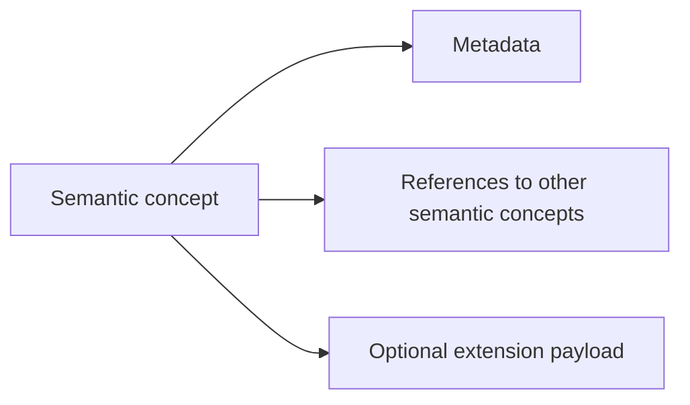

# Semantic IR Design

The Semantic IR is intentionally concept-driven rather than syntax-driven. It
describes what code does, not how a particular language spells it.

## Core Design Goals

- represent intent rather than parsing artifacts
- stay extensible without forcing early commitments
- preserve provenance so every semantic concept can be traced back to source
- keep the model language agnostic after ingestion
- allow future adapters to add specialized data via extension fields

## Concept Families

The IR is expected to grow around semantic concepts such as:

- function
- variable
- mutation
- assignment
- loop
- conditional
- branch
- return
- call
- object
- type
- ownership
- reference
- lifetime
- allocation
- collection
- API usage
- module
- namespace
- pattern match
- async
- transaction
- data flow

Not every concept must exist as a first-class node on day one. The important
part is that the model can accept them later without redesigning the whole IR.

## Extensibility Pattern

The IR should follow a small set of patterns:

- stable identifiers for nodes and relationships
- optional fields for information that may not exist in every language
- generic metadata for adapter-specific annotations
- extension variants for concepts that do not belong in the shared core

## Non-Goals

- compiler lowering details
- syntax tree preservation as a primary concern
- language-specific parsing behavior in the engine
- target machine code generation
